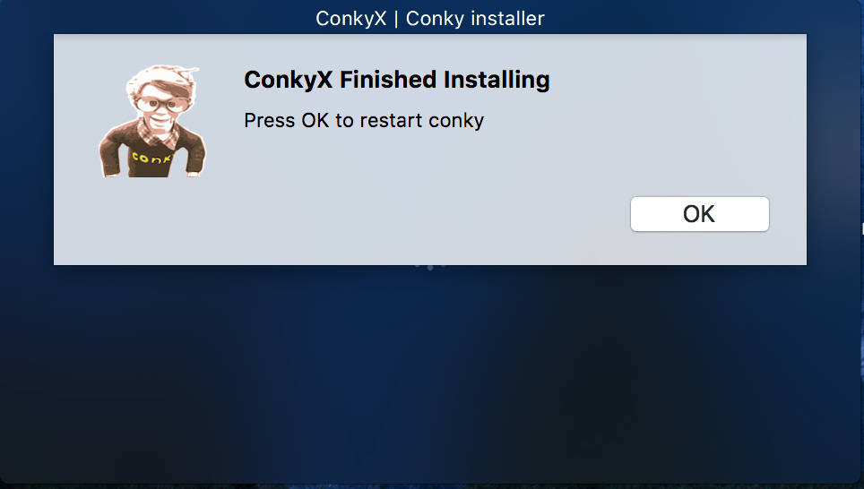

# ConkyX

ConkyX is a native macOS app that comes with conky bundled into it.
It offers the ability to run conky with just a double-click, eliminating the use of the terminal.
It also works as an installer (installs required libraries) the first time it runs.

# NOTES

ConkyX requires Homebrew to be installed [brew](https://brew.sh/)

# COMPATIBILITY

Right now, there is only compiled version for High Sierra (10.13.3).  I am planning to offer a compiled
version for Mavericks (10.9.5).

Grab latest version from [(link)](https://github.com/npyl/ConkyX/releases)

# IMAGES

 
